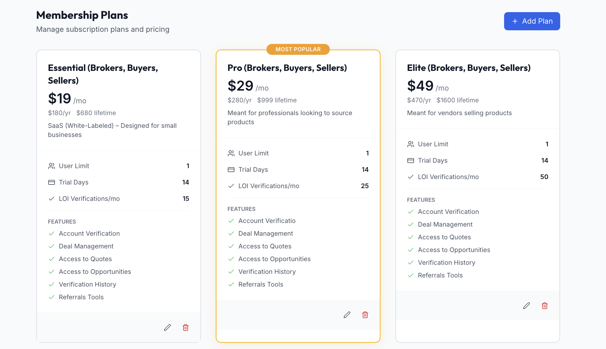
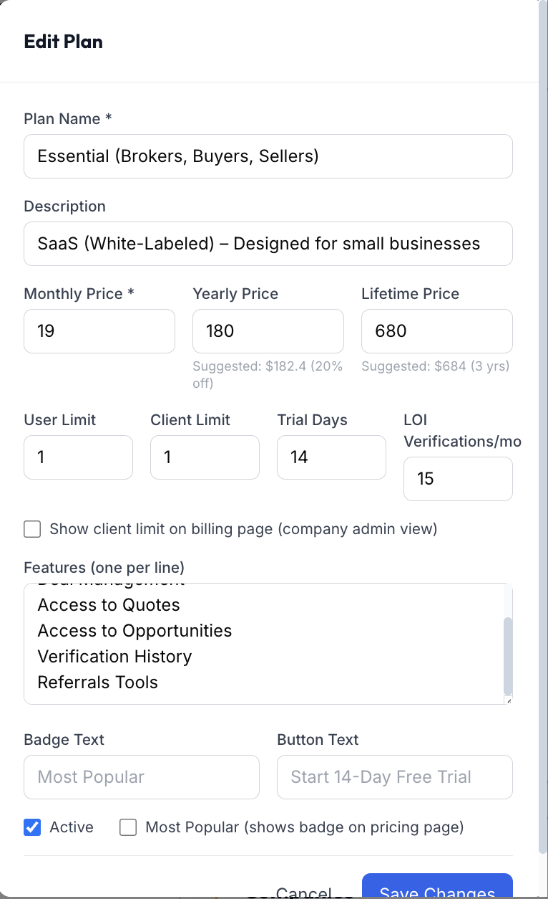
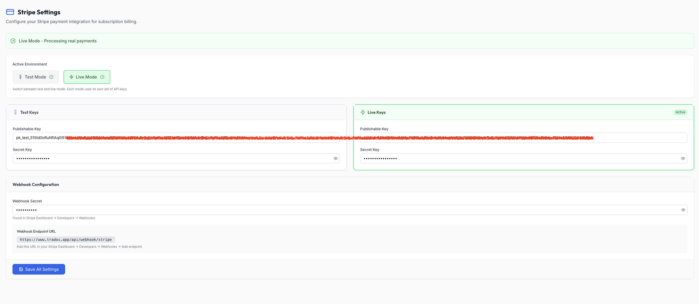

# System: Paid Subscription / Membership System

Full membership stack: admin-defined tiered plans, hosted-checkout payments, a coupon/discount engine, webhook reconciliation, dunning (failed-payment retries), grace periods, and access enforcement. Product-neutral — the subscribing entity ("subscriber") = company/tenant/workspace in multi-tenant apps, or user account in single-tenant.

**Type:** large full feature subsystem (plan catalog + coupon engine + checkout + webhooks + dunning + access guard + admin + subscriber UI + API).

**Reference stack:** FastAPI (Python) + MySQL + React + Stripe (Checkout Sessions + Customer Portal + Webhooks).

> **Related:** [coupon-code-system](../coupon-code-system/SPEC.md) is a narrower, standalone coupon spec from a different source app (types: percentage | free_lifetime). This system's coupon engine adds a `fixed` discount type and is embedded in the broader billing lifecycle. Use this spec for full billing; use the coupon spec if you only need codes bolted onto existing billing.

---

## Visual Reference

Built-result screenshots from the source app — visual guideline for re-implementation.

| View | Preview |
|------|---------|
| Plans grid — Standard/Pro/Elite, "Most Popular" accent (§9.1) |  |
| Edit Plan modal — pricing, limits, features, badge/CTA (§9.1) |  |
| API token / provider-keys page — test/live, masked keys, webhook (§9.6) |  |

---

## Integration Prompt

> Paste everything below this line into the target project.

---

You are given a task to build a **paid subscription / membership system** in the codebase.

Reference stack (map onto project equivalents if different):
- **Frontend:** React (function components + hooks), toast notifications, controlled-input forms. No payment-provider JS SDK required — checkout is hosted.
- **Backend:** Python + FastAPI, async handlers, Pydantic request models. Two routers: authenticated user router (checkout/status/current plan) + super-admin router (plans, coupons, settings, billing review).
- **Database:** MySQL. Tables: `membership_plans`, `coupons`, `payment_transactions`, `platform_settings`, plus subscription-state columns on each subscriber row.
- **Payment provider:** Stripe (Checkout Sessions + Customer Portal + Webhooks). Any provider with hosted checkout + signed webhooks fits.

Replace "subscriber" with the right noun for the product (user, account, team, workspace, company).

### 1. Overview

Major moving parts:
- **Plan catalog** — admin-defined plans: price, billing cycle (monthly/yearly/one-time), usage limits, feature list, optional trial, marketing metadata.
- **Coupon engine** — admin codes granting percentage / fixed / free-lifetime discounts, with usage limits, expiry, per-plan restrictions.
- **Checkout flow** — server-created hosted checkout sessions; price ALWAYS from DB, never client.
- **Webhook reconciler** — provider calls this on every billing event; source of truth for subscription state.
- **Subscription state on subscriber** — plan id, status, paid flag, card-on-file flag, last 4, retry count, grace period, provider sub id.
- **Dunning loop** — failed payments increment retry counter; past threshold → past_due + grace period.
- **Access enforcement** — single helper the app calls to decide whether a subscriber may still use the app.
- **Admin surfaces** — plans CRUD, coupons CRUD, global settings, billing review.
- **Subscriber surface** — billing page: current plan, upgrade/change, payment history.

### 2. Architecture

| Component | Responsibility |
|-----------|----------------|
| Plan Catalog | Plans live entirely in DB, admin-edited. Soft delete (deactivate) instead of hard delete when subscribers exist. |
| Coupon Engine | DB table. Codes uppercase-normalized. Validation: is_active, expiration, usage limit, plan restriction. |
| Hosted Checkout | Server creates provider session, returns redirect URL. Sets metadata (subscriber id, plan id, billing cycle) for webhook correlation. |
| Payment Provider Adapter | Centralized helper: loads right API key (test vs live), configures SDK, exposes small op set. |
| Webhook Endpoint | Verifies signature vs stored secret; processes events into local state; always returns 200 to prevent provider retries. |
| Transaction Ledger | Every checkout recorded before redirect (status "initiated"); webhook/poll updates to completed/failed/expired. Audit + payment history. |
| Access Guard | Pure async function from auth-protected handlers/middleware → `has_access, grace_period, days_remaining, message`. |
| Settings Singleton | Single platform-settings row: grace period days, require-valid-card, overage prices. |

### 3. Domain Model

**3.1 Plan** — `membership_plans` table:

```sql
CREATE TABLE membership_plans (
  id INT UNSIGNED AUTO_INCREMENT PRIMARY KEY,
  name VARCHAR(50) NOT NULL UNIQUE,                 -- Unique, 2–50 chars. Uniqueness enforced on create.
  description TEXT,                                  -- Marketing blurb.
  price DECIMAL(12,2) NOT NULL DEFAULT 0.00,         -- Monthly base price >= 0 (zero = free plan).
  yearly_price DECIMAL(12,2) NULL,                   -- Optional yearly price shown alongside monthly.
  lifetime_price DECIMAL(12,2) NULL,                 -- Optional one-time perpetual price.
  billing_cycle ENUM('monthly','yearly','one_time') NOT NULL DEFAULT 'monthly', -- Drives subscription vs one-time payment.
  user_limit INT UNSIGNED NOT NULL DEFAULT 0,        -- Seats/admin users included. For overage.
  client_limit INT UNSIGNED NOT NULL DEFAULT 0,      -- Customers/clients included (B2B quota). For overage.
  show_client_limit TINYINT(1) NOT NULL DEFAULT 1,   -- Whether to display client limit on cards.
  usage_quota INT UNSIGNED NULL,                     -- Domain-specific monthly quota (e.g. "verifications/month"). Nullable.
  features JSON,                                     -- List of marketing strings (bullets).
  trial_days INT UNSIGNED NOT NULL DEFAULT 0,        -- Trial days; 0 = none.
  is_active TINYINT(1) NOT NULL DEFAULT 1,           -- Soft visibility flag. Inactive hidden from public catalog.
  is_popular TINYINT(1) NOT NULL DEFAULT 0,          -- Highlights card with badge.
  badge_text VARCHAR(50) NULL,                       -- Custom badge label (default "Most Popular").
  cta_text VARCHAR(50) NULL,                         -- Custom button label.
  provider_price_id VARCHAR(255) NULL,               -- Optional cached provider price id (null here — price_data sent per checkout).
  created_at DATETIME NOT NULL,                      -- Audit.
  updated_at DATETIME NOT NULL                       -- Audit.
) ENGINE=InnoDB DEFAULT CHARSET=utf8mb4;
```

**3.2 Coupon** — `coupons` table:

```sql
CREATE TABLE coupons (
  id INT UNSIGNED AUTO_INCREMENT PRIMARY KEY,
  code VARCHAR(30) NOT NULL UNIQUE,                  -- Uppercase, unique, 3–30 chars. Case-insensitive on redemption.
  discount_type ENUM('percentage','fixed','free_lifetime') NOT NULL, -- free_lifetime bypasses provider.
  discount_value INT UNSIGNED NULL,                  -- Percentage (1–100) or fixed amount in cents. Ignored for free_lifetime.
  coupon_type VARCHAR(20) NULL,                      -- Equivalent to discount_type for free_lifetime detection at redemption.
  applicable_plan_ids JSON NULL,                     -- Optional list. If non-empty, code valid only for these plans.
  max_uses INT UNSIGNED NULL,                        -- Total redemption cap.
  current_uses INT UNSIGNED NOT NULL DEFAULT 0,      -- Counter, incremented atomically on redemption.
  valid_from DATETIME NULL,                          -- Optional active window (start).
  expires_at DATETIME NULL,                          -- Optional active window (end).
  is_active TINYINT(1) NOT NULL DEFAULT 1,           -- Manual on/off.
  total_discount_given DECIMAL(12,2) NOT NULL DEFAULT 0.00, -- Sum discounted (reporting).
  usage_history JSON,                                -- Append-only { user_id, subscriber_id, plan_id, plan_name, original_price, discount_amount, redeemed_at }.
  created_at DATETIME NOT NULL,                      -- Audit.
  updated_at DATETIME NOT NULL                       -- Audit.
) ENGINE=InnoDB DEFAULT CHARSET=utf8mb4;
```

**3.3 Subscription state (columns on the subscriber row, NOT a separate table — makes the access guard a single read):**

Added to the subscriber (`companies`) table:

```sql
ALTER TABLE companies
  ADD COLUMN membership_plan_id INT UNSIGNED NULL,                 -- Reference to plan.
  ADD COLUMN subscription_status ENUM('none','trialing','active','past_due','cancelled') NOT NULL DEFAULT 'none', -- Mirrors provider.
  ADD COLUMN subscription_type ENUM('subscription','one_time','free_lifetime') NULL,
  ADD COLUMN subscription_started_at DATETIME NULL,                -- Activation time.
  ADD COLUMN provider_subscription_id VARCHAR(255) NULL,           -- Provider sub id; correlates webhooks.
  ADD COLUMN provider_customer_id VARCHAR(255) NULL,               -- Provider customer id; for Customer Portal.
  ADD COLUMN is_paid TINYINT(1) NOT NULL DEFAULT 0,                -- Convenience bool — true if active or free_lifetime. Webhook-maintained.
  ADD COLUMN cc_valid TINYINT(1) NOT NULL DEFAULT 0,               -- Working payment method on file.
  ADD COLUMN cc_last4 VARCHAR(4) NULL,                             -- Display-only card metadata.
  ADD COLUMN cc_expiry VARCHAR(7) NULL,                            -- Display-only card metadata (e.g. "12/2025").
  ADD COLUMN payment_retry_count INT UNSIGNED NOT NULL DEFAULT 0,  -- Consecutive payment failures (dunning).
  ADD COLUMN last_payment_failure DATETIME NULL,                   -- Timestamp of last failure.
  ADD COLUMN last_payment_error VARCHAR(512) NULL,                 -- Extracted provider message.
  ADD COLUMN grace_period_ends DATETIME NULL,                      -- If not null + future, access granted with warning.
  ADD COLUMN coupon_code_used VARCHAR(30) NULL,                    -- Code redeemed at activation.
  ADD CONSTRAINT fk_companies_membership_plan FOREIGN KEY (membership_plan_id) REFERENCES membership_plans(id);
```

**3.4 Payment transaction** — `payment_transactions` table, one row per checkout attempt:

```sql
CREATE TABLE payment_transactions (
  id INT UNSIGNED AUTO_INCREMENT PRIMARY KEY,
  session_id VARCHAR(255) NULL,                      -- Provider checkout session id.
  user_id INT UNSIGNED NULL,                         -- Who.
  subscriber_id INT UNSIGNED NULL,                   -- For whom.
  plan_id INT UNSIGNED NULL,                         -- For what.
  amount DECIMAL(12,2) NULL,                         -- Both forms stored; cents authoritative.
  amount_cents INT UNSIGNED NULL,                    -- Authoritative amount in cents.
  currency VARCHAR(3) NULL,                          -- ISO currency code.
  status ENUM('initiated','completed','failed') NOT NULL DEFAULT 'initiated',
  payment_status ENUM('pending','paid','unpaid','expired','free') NULL, -- Provider-reported.
  type ENUM('subscription','one_time','free_lifetime') NULL,
  billing_cycle VARCHAR(20) NULL,                    -- Plan snapshot at checkout.
  trial_days INT UNSIGNED NULL,                      -- Plan snapshot at checkout.
  coupon_code VARCHAR(30) NULL,                      -- If applied.
  metadata JSON,                                     -- Mirrors provider metadata for reliable webhook correlation.
  webhook_processed_at DATETIME NULL,                -- Set when matching webhook handled.
  created_at DATETIME NOT NULL,                      -- Audit.
  updated_at DATETIME NOT NULL,                      -- Audit.
  INDEX idx_payment_tx_session (session_id),
  INDEX idx_payment_tx_subscriber (subscriber_id)
) ENGINE=InnoDB DEFAULT CHARSET=utf8mb4;
```

**3.5 Membership Settings (singleton)** — `platform_settings`, a single-row settings table:

Enforce a single row (e.g. `id = 1`). This table holds the membership settings below **plus** the provider keys from §8, which live as additional columns here and are masked by the API on read (behavior unchanged). A key/value `platform_settings` table (setting name → value) is an equivalent alternative.

```sql
CREATE TABLE platform_settings (
  id INT UNSIGNED AUTO_INCREMENT PRIMARY KEY,
  require_valid_cc TINYINT(1) NOT NULL DEFAULT 0,               -- If true, access guard restricts subscribers without valid card.
  grace_period_days INT UNSIGNED NOT NULL DEFAULT 14,          -- Days after billing failure before restriction. Default 14.
  overage_price_per_user DECIMAL(12,2) NOT NULL DEFAULT 10.00,     -- Reference unit-price for over-limit seats. Default 10.0.
  overage_price_per_customer DECIMAL(12,2) NOT NULL DEFAULT 5.00,  -- Reference unit-price for over-limit customers. Default 5.0.
  updated_at DATETIME NULL                                     -- Audit.
) ENGINE=InnoDB DEFAULT CHARSET=utf8mb4;
```

### 4. Subscription Lifecycle

```
none ──checkout success──► trialing ──trial ends──► active
  │                          │                         │
  │                          └───────────────┐         │
  │                                          ▼         ▼
  │            ┌──────────────────────► past_due (retry < 3)
  │            │                              │
  │            │                              ▼  retry ≥ 3
  │            │                  past_due + grace_period_ends set
  │            │                              │
  │  invoice.paid (recovery)                  │  grace expires
  │            │                              ▼
  │            └──────────────────► access restricted
  │
  └── free coupon ──► active (subscription_type = free_lifetime)
                            │
                            └── (no recurring payments)
  active ── customer.subscription.deleted ──► cancelled
```

### 5. Payment Processing Flow

**5.1 Server-created checkout (security):**
1. Authenticated subscriber submits `{ plan_id, origin_url, coupon_code? }`.
2. Server loads plan from DB. **Price NEVER from client.**
3. Reject if plan missing or inactive.
4. Mode: `"subscription"` for monthly/yearly, `"payment"` for one_time.
5. Build `line_items` inline using `price_data` — no pre-created Price object needed (zero admin setup to launch a plan).
6. Trial days, if any, attached to `subscription_data`.
7. `metadata = { user_id, subscriber_id, plan_id, plan_name, billing_cycle, type }` for webhook correlation without DB queries.
8. Success URL = `origin + billing_path + ?session_id={CHECKOUT_SESSION_ID}&status=success`. Cancel URL = `origin + billing_path + ?status=cancelled`.
9. Create session, then immediately insert `payment_transactions` row status `"initiated"` (abandoned checkouts visible to admin).
10. Return `{ checkout_url, session_id }`. Client redirects.

**5.2 Status reconciliation (two redundant channels — webhooks may be delayed/undeliverable, and the subscriber expects immediate feedback):**
- **Polling:** success page calls `GET /payments/status/{session_id}`. Server retrieves session from provider, updates transaction, if `payment_status == "paid"` calls `activate_subscription()`. Polled every few seconds until final.
- **Webhook:** provider posts to `/webhook/stripe` on every event. Signature verified vs stored secret. Same `activate_subscription()` path runs, idempotently.

**5.3 Activation** — `activate_subscription()` writes the subscriber's state columns:
```sql
UPDATE companies SET
  membership_plan_id       = :transaction_plan_id,
  subscription_status      = 'active',
  subscription_started_at  = NOW(),
  provider_subscription_id = :session_subscription,
  is_paid                  = 1,
  cc_valid                 = 1,
  grace_period_ends        = NULL,
  payment_retry_count      = 0
WHERE id = :subscriber_id;
-- Best-effort: pull cc_last4 / cc_expiry from PaymentMethod.list(customer)
```

**5.4 Free-lifetime activation (no provider):**
1. Subscriber posts `{ plan_id, coupon_code }` to `/payments/activate-free`.
2. Validate coupon: is_active, `coupon_type == "free_lifetime"`, not expired, `current_uses < max_uses`, plan id in `applicable_plan_ids` if restricted.
3. Increment counters + push usage_history entry in a single atomic update.
4. Move subscriber to `active`, `subscription_type = "free_lifetime"`, record `coupon_code_used`.
5. Insert `payment_transactions` row: amount 0, type "free_lifetime", status "completed".

### 6. Webhook Event Handling

Endpoint MUST verify provider signature vs stored secret. After processing, **always return 200 even on internal errors** (non-2xx → provider retries → duplicated work). Log internally instead.

| Event | Action |
|-------|--------|
| `checkout.session.completed` | Mark transaction completed; run `activate_subscription()`; read PaymentMethod to cache `cc_last4`/`cc_expiry`/`provider_customer_id`. |
| `checkout.session.expired` | Mark transaction failed/expired. No subscriber state change. |
| `invoice.paid` | Recurring charge succeeded. Re-mark `is_paid=True`, `cc_valid=True`, `subscription_status=active`, clear `grace_period_ends` + `payment_retry_count`, clear last error fields. |
| `invoice.payment_failed` | Increment `payment_retry_count`. If `>= 3`: `is_paid=False`, `cc_valid=False`, `subscription_status=past_due`, start `grace_period_ends = now + grace_period_days`. Else just `subscription_status=past_due`. |
| `customer.subscription.deleted` | `subscription_status=cancelled`. Access guard evaluates as normal. |

### 7. Dunning & Access Enforcement

**7.1 Dunning policy:**
- Each failed invoice increments `payment_retry_count`.
- On 3rd consecutive failure → `past_due` AND grace period (default 14 days) begins.
- Any `invoice.paid` resets counter to 0 and clears `grace_period_ends`.
- Threshold + grace duration admin-configurable.

**7.2 Access guard** — single async `check_subscriber_access(subscriber_id)` called by auth-protected handlers/middleware:
```python
settings = SELECT * FROM platform_settings LIMIT 1   -- single settings row
if not settings.require_valid_cc:
    return { has_access: True, grace_period: False }

s = SELECT * FROM companies WHERE id = subscriber_id  -- single subscriber row
if s.is_paid or s.cc_valid:
    return { has_access: True, grace_period: False }

if s.grace_period_ends and s.grace_period_ends > now:
    return {
      has_access:   True,
      grace_period: True,
      days_remaining: (s.grace_period_ends - now).days,
      message:      "Your payment method needs updating. You have N days..."
    }

return {
  has_access: False,
  message:    "Your account requires a valid payment method."
}
```
Calling sites turn `has_access == False` into a 402 or billing-page redirect; `grace_period == True` → non-blocking banner.

### 8. Payment Provider Configuration

API keys + webhook secret stored as columns on the `platform_settings` row (NOT env) so admins rotate them via admin UI without redeploys.

| Setting | Purpose |
|---------|---------|
| `stripe_mode` | `"test" \| "live"`. Drives which key loaded. |
| `test_publishable_key` / `test_secret_key` | Used when mode == test. |
| `live_publishable_key` / `live_secret_key` | Used when mode == live. |
| `legacy_secret_key` | Backwards-compat single-key field. Validated against active mode (must start with expected prefix). |
| `webhook_secret` | Shared across modes for signature verification. |
| Env fallback | If nothing in DB, fall back to environment variables. |

**Mode/key validation:** if the legacy single-key field's prefix doesn't match active mode, the loader REFUSES it and returns None. Prevents charging live cards from a test deployment, or vice-versa.

### 9. Admin UI

**9.1 Plans page** — header + "Add Plan"; responsive grid (1/2/3 cols). Card: popular badge, name + Inactive pill, large price + /mo, optional /yr + lifetime row, description, limits section (users, customers if `show_client_limit`), feature list. Editor modal surfaces trial days, billing cycle, popularity badge text, CTA text. Edit/Deactivate per card. Deactivate = soft delete; `force=true` also clears the plan ref from non-active subscribers. Hard-delete blocked while active/trialing subscribers exist.

**9.2 Coupons page** — table/grid sorted `created_at` desc. Create form: code (auto-uppercased), discount_type, discount_value, max_uses, valid_from, valid_until, applicable_plan_ids (multi-select against catalog), is_active. Each row: `current_uses / max_uses`, total_discount_given, most-recent redemption. Delete is hard (only for unused codes; safer policy: deactivate).

**9.3 Membership settings page** — `require_valid_cc` toggle, `grace_period_days` (≥0), `overage_price_per_user` + `overage_price_per_customer`. Save writes singleton; values clamp non-negative.

**9.4 Billing review (per subscriber)** — list: current plan, subscription_status, is_paid, cc_valid, cc_last4, grace_period_ends, user_count vs user_limit, customer_count vs customer_limit, computed overage. Filter by status. Per-row override: manually set is_paid / cc_valid / subscription_status (unpaid + no cc starts grace; paid clears it). Header KPIs: total/active/trialing/past_due/cancelled/paid/cc_valid/in-grace subscribers, MRR, ARR. MRR = monthly prices + yearly/12 of active subs; free_lifetime + one_time excluded.

**9.5 Bulk assignment tool** — retroactively assign a default plan to subscribers without one, with `dry_run` flag. Picks defaults by highest role present. Skips subscribers already on active/trialing.

**9.6 API token / provider keys page** — admin screen to save + validate the payment-provider credentials (§8) without redeploys.

Layout:
- **Mode toggle:** Test / Live (`stripe_mode`). The active mode drives which key set is used at runtime; the page shows which mode is live so admins don't mix them up.
- **Key fields:** publishable + secret key for the selected mode (`test_*` / `live_*`), `webhook_secret`, optional `legacy_secret_key`. Secret fields are **password-type inputs**, pre-filled masked (`sk_live_****…1234` — last 4 only) and never returned in plaintext from the API. Empty submit = leave unchanged; only non-masked edits are persisted.
- **Save:** `PUT /admin/membership/provider-keys`. Server validates each key's prefix against its mode (`pk_test_`/`sk_test_` vs `pk_live_`/`sk_live_`) and REFUSES on mismatch (§8 rule) with a field-level error. Stores in `platform_settings`, sets `updated_at`. Success toast.
- **Validate / Test connection:** `POST /admin/membership/provider-keys/validate` — server makes one lightweight live provider call with the saved (or just-entered) key (e.g. retrieve account / list 1 price). Returns `{ valid, mode, account_id?, message }`. UI shows a green "Connected — acct_…" or red error with the provider's message. Validates BEFORE the admin relies on checkout. Does not charge anything.
- **Webhook check:** display the expected webhook URL (`{origin}/webhook/stripe`) to copy into the provider dashboard, plus a "last webhook received at" timestamp (from the most recent `webhook_processed_at`) so admins can confirm delivery is wired.
- **Status row:** badges for `mode`, `keys saved?`, `last validated at`, `webhook seen?`.

Behavior: masked secrets are never echoed back; a save with the field left at its masked placeholder is a no-op for that field. Validate is rate-limited / debounced to avoid hammering the provider. All actions super-admin only.

### 10. Subscriber UI (Billing Page)

- **Current plan:** name, price, billing cycle, trial-end/next-renewal date, status badge.
- **Card on file:** cc_last4 + cc_expiry; "Update payment method" deep-links to provider Customer Portal.
- **Plan grid (upgrade/change):** same card design as admin, sorted by price asc, inactive hidden, popularity badge.
- **Coupon code input + Apply** per card or shared field. On Apply: free_lifetime → `/payments/activate-free`; otherwise pass `coupon_code` to `/payments/subscribe` (server applies to checkout session).
- **Payment history table:** amount, currency, status, type, created_at. From `/payments/transactions`.
- **Status banners:** in-grace warning, past_due CTA, restricted state.

### 11. API Surface

**Subscriber (authenticated):**

| Endpoint | Purpose |
|----------|---------|
| `POST /payments/subscribe` | Create hosted-checkout session; optional coupon. Returns checkout_url + session_id. |
| `GET /payments/status/{session_id}` | Reconcile + return payment status; idempotently activates if paid. |
| `POST /payments/activate-free` | Activate free_lifetime coupon without provider. |
| `GET /payments/current-plan` | Current plan, subscription_status, subscription_started_at. |
| `GET /payments/transactions` | Up to 50 most-recent transactions for caller. |

**Admin (super-admin only):**

| Endpoint | Purpose |
|----------|---------|
| `GET /main-admin/membership-plans` | List plans with subscriber counts. |
| `POST /main-admin/membership-plans` | Create plan. Rejects duplicate name. |
| `PUT /main-admin/membership-plans/{id}` | Patch plan. |
| `DELETE /main-admin/membership-plans/{id}?force=bool` | Soft delete. Refuses if active/trialing subscribers. `force=true` clears plan ref from non-active subscribers. |
| `GET /main-admin/coupons` | List coupons (newest first). |
| `POST /main-admin/coupons` | Create coupon. |
| `DELETE /main-admin/coupons/{id}` | Hard-delete coupon. |
| `GET /admin/membership/settings` | Get global membership settings. |
| `PUT /admin/membership/settings` | Update global membership settings. |
| `GET /admin/membership/provider-keys` | Get provider key config — secrets MASKED (last 4 only), plus mode, last_validated_at, webhook URL + last-seen. |
| `PUT /admin/membership/provider-keys` | Save provider keys + webhook secret + mode. Prefix-validated per mode; refuses mismatch. Masked/empty fields = no-op. |
| `POST /admin/membership/provider-keys/validate` | Test connection — one lightweight provider call with active key. Returns `{ valid, mode, account_id?, message }`. No charge. |
| `GET /admin/membership/companies` | Per-subscriber billing status + overage. Filter by status. |
| `PUT /admin/membership/companies/{id}/payment-status` | Manual override of is_paid / cc_valid / subscription_status. |
| `GET /admin/membership/summary` | Dashboard KPIs (MRR, ARR, counts by status, settings). |
| `GET /admin/membership/review-assignments` | Subscribers + plan + user/role inventory for bulk assignment. |
| `POST /admin/membership/assign-plans` | Bulk-assign default plans by role with `dry_run`. |
| `POST /webhook/stripe` (provider POST) | Signed webhook receiver. |

### 12. Security Rules

- Price always loaded from DB; client never specifies amount.
- Plan `is_active` enforced server-side at checkout creation.
- Webhook signature verified vs stored secret before any state change.
- Webhook endpoint returns 200 even on internal errors (logged) to avoid retry storms.
- Status endpoint cross-checks the session belongs to the caller's subscriber unless caller is super-admin.
- API key loader REFUSES a key whose prefix doesn't match current mode (test vs live).
- All plan/coupon/settings/billing-review endpoints gated to super-admin role.
- Provider keys masked in admin UI ("sk_****"), only updated, never read back in plaintext.
- `GET /admin/membership/provider-keys` returns secrets masked (last 4 only); a save left at the masked placeholder is a no-op (never overwrites a real key with the mask).
- Provider-key save re-applies the prefix-vs-mode check and rejects mismatches before persisting; validate makes a non-charging read-only provider call.

### 13. Visual Design Tokens

| Token | Value / usage |
|-------|---------------|
| Primary action | Blue (`#2563EB` family) — Add Plan, Save, Subscribe. |
| Popular card accent | Amber (`#F59E0B` / `#E5A225`) — border, glow shadow, badge fill. |
| Inactive plan | Muted opacity 60% + small gray pill. |
| Status pills | active = green, trialing = blue, past_due = red, cancelled = gray, none = gray. |
| Container | max-width ~6xl, centered, p-6/p-8. |
| Plan card | rounded-xl, border-2, p-6 sections separated by border-b. Popular: box-shadow `0 4px 24px rgba(amber,0.15)`. |
| Price typography | 3xl bold amount, gray /mo suffix, smaller secondary row for yearly/lifetime. |
| Features | Check icon + line, rendered from string list. |

### 14. Access Control Summary

- **Public:** `GET /membership-plans` (only `is_active = true`).
- **Authenticated subscriber:** subscribe / activate-free / status / current-plan / transactions, scoped to own subscriber id.
- **Super-admin only:** plan CRUD, coupon CRUD, membership settings, billing review + overrides, bulk assignment, provider key management.
- **Webhook:** no auth header — protected by signature verification.

### Reproduction Checklist

1. Create four tables: `membership_plans`, `coupons`, `payment_transactions`, `platform_settings` (single-row).
2. Add subscription state columns to the subscriber (`companies`) table (plan_id, status, is_paid, cc_valid, cc_last4, cc_expiry, grace_period_ends, retry count, provider_subscription_id, provider_customer_id).
3. Build admin Plans CRUD (super-admin). Enforce unique name. Soft delete with active-subscriber guard.
4. Build admin Coupons CRUD. Normalize codes uppercase. Validate discount_type + limits.
5. Build singleton membership-settings GET/PUT with defaults (grace_period_days=14, require_valid_cc=false).
6. Implement provider key loader: mode + dedicated test/live keys + env fallback + prefix-mismatch refusal.
6b. Build the API token / provider-keys admin page (§9.6) + endpoints: GET (masked), PUT (prefix-validated save), POST validate (test connection). Masked-field save = no-op.
7. Implement `POST /payments/subscribe`: load plan from DB, build inline price_data, attach metadata, insert pending transaction, return checkout_url.
8. Implement `GET /payments/status/{session_id}`: retrieve session, update transaction, activate on paid, return status.
9. Implement `POST /payments/activate-free` with full coupon validation + atomic redemption counters.
10. Implement signed webhook with handlers for checkout.completed, checkout.expired, invoice.paid, invoice.payment_failed (with dunning), customer.subscription.deleted. Always return 200.
11. Implement `check_subscriber_access()` and call from auth dependency/middleware. Grace → banner; restricted → 402 or billing redirect.
12. Build admin Billing Review with status filter, per-row override, KPI summary (MRR/ARR from active subs).
13. Build subscriber Billing page (current plan, payment history, plan grid + coupon input, status banners).
14. (Optional) Bulk-assignment tool with dry_run.
15. (Optional) Wire provider Customer Portal link for self-serve card/plan changes.

---

## System Metadata

| Field | Value |
|-------|-------|
| Category | Billing / subscriptions / membership (full stack) |
| Backend | FastAPI (async) + MySQL |
| Frontend | React + shared API client |
| Payments | Stripe (Checkout + Customer Portal + Webhooks) |
| Coupon types | percentage, fixed, free_lifetime |
| Key concepts | DB-only plan catalog, embedded subscription state, two-channel reconciliation (poll + webhook), dunning + grace, single access guard |
| Multi-tenant | Yes — "subscriber" = company/tenant/workspace or user |
| Related | [coupon-code-system](../coupon-code-system/SPEC.md) — narrower standalone coupon spec |
