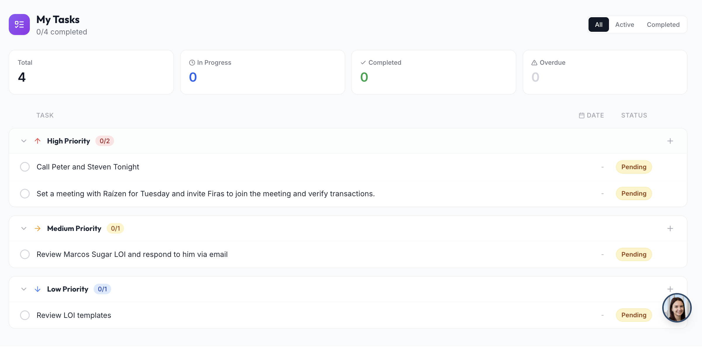

# System: Personal Task / To-Do System

Each authenticated user owns a private task list. Tasks have title, priority (high/medium/low), three-state workflow (pending → in_progress → complete), optional due date, free-text notes, and an optional flag exposing the task to other admins in the same tenant. List rendered as three priority groups, sortable within each group, with a global filter (All / Active / Completed) + summary KPIs.

**Type:** full feature subsystem (single collection + API + UI). Multi-tenant share model optional.

**Reference stack:** FastAPI (Python) + MongoDB-style doc store (single collection `user_todos`) + React.

> Same model carries over for personal notes, simple Kanban (swap priority groups → status columns), or any single-owner-with-optional-share list.

---

## Visual Reference

Built-result screenshot from the source app — visual guideline for re-implementation.

| View | Preview |
|------|---------|
| My Tasks — KPI cards, All/Active/Completed filter, priority groups, status pills (§8) |  |

---

## Integration Prompt

> Paste everything below this line into the target project. Swap "tenant" for the right noun (company / team / workspace / account). Single-tenant apps skip the share-with-admins section.

---

You are given a task to build a **personal task / to-do system** in the codebase.

Reference stack (map onto equivalents):
- **Frontend:** React (function components + hooks), plain forms, toast notifications. Drag-to-reorder supported by API but optional in UI.
- **Backend:** Python + FastAPI, async, Pydantic create/update models.
- **Database:** document store (MongoDB-style). Single collection `user_todos`.
- **Auth:** JWT-style dependency returning `sub` (user id), tenant id, role.

### 1. Overview

- **User-private:** a user only ever sees their own tasks, plus tasks shared by other admins of the same tenant.
- **Three priority groups:** high, medium, low — each collapsible, each with a per-group inline add form.
- **Three statuses:** pending, in_progress, complete. Toggle-complete is one-tap; intermediate state set from edit dialog.
- **Soft delete only** — deleted tasks stay in DB with a `deleted` flag.
- **Shared tasks** surface in admins' lists with a "shared by <name>" badge.

### 2. Data Model — `user_todos` collection

| Field | Description |
|-------|-------------|
| `_id` | Task id. |
| `user_id` | Owner — authenticated user that created the task. |
| `tenant_id` | Owner's tenant (captured at creation; used by share-with-admins query). |
| `title` | Required, trimmed. |
| `priority` | `"high" \| "medium" \| "low"`. Default `"medium"`. |
| `priority_order` | Numeric mirror of priority for sorting: high=0, medium=1, low=2. Kept in sync with priority on every write. |
| `status` | `"pending" \| "in_progress" \| "complete"`. Default `"pending"`. |
| `due_date` | ISO-8601 datetime or null. Parser accepts trailing `"Z"`. |
| `notes` | Optional free text (trimmed; null if empty). |
| `shared_with_admins` | Bool. When true, other admins in the same tenant can see + edit. |
| `order` | Within-priority sort position. New tasks get next-highest within their priority. |
| `deleted` / `deleted_at` | Soft-delete flag + timestamp. |
| `completed_at` | Set when status → `"complete"`. |
| `created_at` / `updated_at` | Audit. |

### 3. Sorting

Every list query sorts ascending by `priority_order`, then ascending by `order`, then descending by `created_at` (stable tiebreaker) → "high first, then within priority by user-set order, newest on top when order is equal":
```python
sort = [ ("priority_order", 1), ("order", 1), ("created_at", -1) ]
```

### 4. Sharing Model

One-way visibility flag toggled by the owner. No accept/decline; once `shared_with_admins=true`, any admin in the same tenant sees the task in their own list, tagged as shared.

**4.1 Visibility query:**
```python
base = { "deleted": { "$ne": True }, ...optional status / priority filters }

# 1) own tasks
own = { "user_id": self, **base }

# 2) shared-by-other-admins-in-same-tenant (admin roles only)
if is_admin(self) and self.tenant_id:
    shared = {
      "tenant_id":          self.tenant_id,
      "shared_with_admins": True,
      "user_id":            { "$ne": self },
      **base
    }
    query = { "$or": [ own, shared ] }
else:
    query = own

# Optional ?shared=only returns just the shared set.
```

Shared rows arrive at the client with a synthetic `is_shared=true` flag and a `shared_by="First Last"` field (resolved from owner's profile) so the UI renders an attribution badge without a second round trip.

**4.2 Edit semantics on shared tasks:** the update endpoint enforces `{ user_id == self }` — only the owner may mutate. Admins viewing a shared task can toggle/read but cannot persist edits. UI mirrors this: hide share checkbox on shared rows, treat inline controls as read-only outside owner's session. (For co-edit: remove the `user_id` predicate from update query, add audit field `last_edited_by`.)

### 5. Status Workflow

```
(create)
   │
   ▼
 pending ◄──────── toggle (one-tap) ────────► complete
   │                                              ▲
   │ open edit dialog and change status           │
   ▼                                              │
 in_progress ── open edit dialog ─────────────────┘
```

- Toggle (one-tap) flips between pending and complete; setting complete stamps `completed_at`.
- `in_progress` reachable only through edit dialog's status dropdown.
- Status changes update `updated_at`; complete additionally stamps `completed_at`.
- Soft delete reversible by clearing `deleted` flag, though no UI exposes it in reference.

### 6. API Surface

| Endpoint | Behavior |
|----------|----------|
| `GET /todos?status=&priority=&shared=` | List caller's tasks + admin-shared tasks (per §4). Sorted as §3. |
| `POST /todos` | Create. Body `{ title, priority, due_date?, notes?, shared_with_admins? }`. Server computes `priority_order`, next `order` within priority group, `tenant_id` from auth. |
| `PUT /todos/{id}` | Update title / priority (+priority_order) / status (sets completed_at on complete) / due_date (`""` clears) / notes (`""` clears) / order / shared_with_admins. Owner-only (404 if not own). |
| `POST /todos/{id}/toggle` | Flip pending ↔ complete; stamp completed_at when going complete. |
| `DELETE /todos/{id}` | Soft delete — sets `deleted=true` + `deleted_at`. |

All endpoints require auth. Owner-scoped predicates protect every write so non-owners can't mutate through the public API.

### 7. Validation Rules

- `title` required, trimmed.
- `priority` ∈ `{ high, medium, low }` — else 400.
- `status` ∈ `{ pending, in_progress, complete }` — else 400.
- `due_date` parsed via `fromisoformat` after replacing trailing `"Z"` with `"+00:00"`; invalid → 400; empty string clears.
- `notes` trimmed; empty string → null.
- `order` accepts any integer; no global uniqueness — per-priority by convention.

### 8. UI / UX

**8.1 Page header** — brand-tinted icon tile + "My Tasks". Subtitle: "<completed>/<total> completed" + inline red "· N overdue" when any task has past `due_date` and `status != complete`. Right side: 3-segment filter pill — All / Active / Completed (Active = pending or in_progress; Completed = complete; All = everything).

**8.2 Summary cards (optional)** — row of small KPI cards above groups: Total, Completed, In Progress, Overdue. Computed client-side.

**8.3 Priority group** — three stacked groups: High (red), Medium (amber), Low (blue). Each a card with header row: caret (collapse/expand), priority arrow icon, label, "<done>/<total>" pill in group color, "+" button right. "+" reveals inline add form INSIDE the group: title + share toggle + due-date picker + Add. Enter submits; Esc cancels. Header click (except "+") toggles collapse. Body lists tasks (only when expanded); empty state shows tiny "Add a task" link.

**8.4 Task row** — round checkbox left (one tap → `/toggle`). Title (line-through + muted when complete). Status pill (Pending / In Progress / Complete), colored. Due-date chip — neutral when future, red "overdue" tone when past + not complete; formatted "MMM D" relative or "Today". Owner-shared task → small violet "Shared" pill. Shared task from another admin → violet "<sharer name>" pill instead. Trailing kebab: Edit / Delete.

**8.5 Edit dialog** — modal: title input, priority select, status select, due-date input, notes textarea. Owner-only "Share with admins" checkbox; hidden if row is shared TO the current user. Save → `PUT /todos/{id}` with full delta; Delete → `DELETE`; Cancel closes.

### 9. Visual Design Tokens

| Token | Value / usage |
|-------|---------------|
| Priority high | color `#EF4444`, bg `#FEF2F2`, border `#FECACA`, badge bg `#FEE2E2` / text `#991B1B`, icon ArrowUp |
| Priority medium | color `#F59E0B`, bg `#FFFBEB`, border `#FDE68A`, badge bg `#FEF3C7` / text `#92400E`, icon ArrowRight |
| Priority low | color `#3B82F6`, bg `#EFF6FF`, border `#BFDBFE`, badge bg `#DBEAFE` / text `#1E40AF`, icon ArrowDown |
| Status pending | bg `#FEF3C7`, text `#92400E`, border `#FDE68A` |
| Status in_progress | bg `#DBEAFE`, text `#1E40AF`, border `#BFDBFE` |
| Status complete | bg `#D1FAE5`, text `#065F46`, border `#A7F3D0` |
| Shared accent | violet — buttons `text-violet-700 bg-violet-50 border-violet-300`; pill `text-violet-700` |
| Header icon tile | gradient violet → purple, 10×10, rounded-xl, white icon |
| Filter pill | white card with internal rounded buttons; active tab `gray-900` bg with white text |
| Container | comfortable reading width; p-6/p-8; bg gray-50/50 |

### 10. Security Rules

- All endpoints require auth; `user_id` from session, never request body.
- `tenant_id` captured at creation from session; used only by visibility query — not editable by user.
- Update + delete predicates always include `{ user_id: self }` so non-owners can't mutate.
- Reads expose other users' tasks only when `shared_with_admins=true` AND `tenant_id` matches AND caller is an admin role.
- Notes/title plain text on client (no HTML rendering) — user content can't inject markup.
- Soft delete keeps history for audit; provide an admin tool for GDPR-style hard-delete if needed.

### Reproduction Checklist

1. Create `user_todos`. Index `{ user_id, deleted, priority_order, order }` for personal-list query and `{ tenant_id, shared_with_admins }` for shared-by-admins query.
2. Implement Pydantic create/update models with the three enum fields validated.
3. Implement `GET /todos` with sharing OR-query (§4) + sort tuple (§3). Resolve `shared_by` names in a second pass during serialization.
4. Implement `POST /todos`: capture `user_id` + `tenant_id` from auth; compute next `order` within priority bucket; set `priority_order` from static mapping.
5. Implement `PUT /todos/{id}` with owner-only predicate, field-by-field PATCH, `completed_at` stamping on complete, empty-string clearing for due_date/notes.
6. Implement `POST /todos/{id}/toggle` + `DELETE /todos/{id}`.
7. Build page header with completion summary, overdue counter, All/Active/Completed filter.
8. Build three collapsible priority groups with per-group inline add forms + "+" button.
9. Build row component: checkbox, status pill, due-date chip, share/shared-by pill, kebab menu.
10. Build edit dialog with all fields + owner-only share toggle.
11. (Optional) Drag-to-reorder by writing `PUT /todos/{id}` with new `order` on drop; API already supports it.

---

## System Metadata

| Field | Value |
|-------|-------|
| Category | Productivity / task management |
| Backend | FastAPI (async) + single doc collection |
| Frontend | React |
| Workflow | 3 priority groups, 3 statuses, one-tap toggle, soft delete |
| Sharing | One-way visibility flag to same-tenant admins (owner-only edit) |
| Multi-tenant | Optional — share section skippable for single-tenant |
| Reusable for | Personal notes, simple Kanban (priority groups → status columns) |
