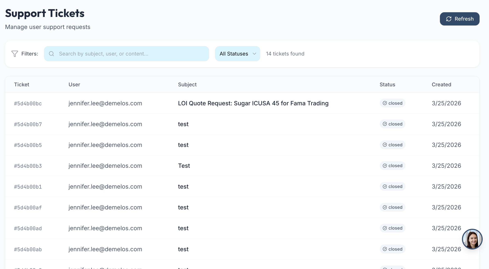
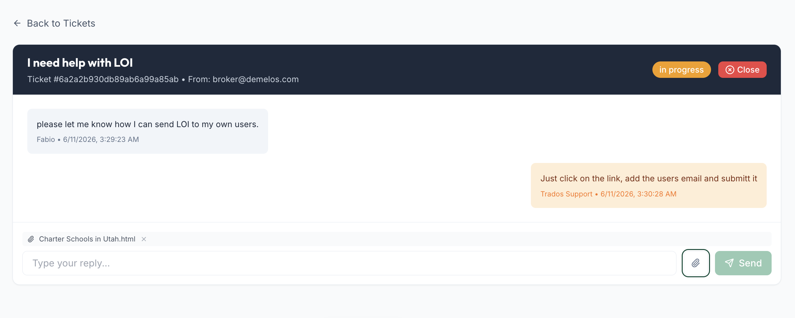

# System: Support Ticket System

Full internal helpdesk / support ticket system. Authenticated users open tickets, exchange threaded **comments**, attach **multiple files**, and admins triage with **assignees, members/watchers, priorities, departments, configurable statuses, time tracking, an activity log, and stats**. Status changes, assignment, and updates fire **email + in-app + push notifications**. Tickets can be **private**, carry **due dates** with overdue reminders, and are scoped by **role-based visibility levels**.

**Type:** full feature subsystem (tickets + 6 child entities + configurable settings + dual API + admin/mobile UI + notifications).

**Reference implementations:**
- **A — Alta Apps (richer, this build):** PHP + MySQL + React admin UI (`tickets-ui`) + JWT mobile API + S3-style object storage + push (Expo/FCM). The feature-complete reference.
- **B — Trados (simpler origin):** FastAPI + MongoDB + React. Minimal 3-status single-thread variant (see history) — a subset of this spec.

> ## ⚠️ Integration target: demelos.com admin portal
> This ticket system is **not a standalone app** — it must be **fully integrated into the demelos.com admin portal** (the [admin-portal-system](../admin-portal-system/SPEC.md) chassis: Express + TypeScript + MySQL + React), sharing that portal's auth/roles, layout/sidebar, design tokens, notification stack, and `uploads/` storage.
>
> The demelos admin already ships a native ticket module to build on/reconcile with:
> - `backend/src/routes/tickets.ts` — Express/TS routes
> - `frontend/src/pages/Tickets.tsx` + `tickets.css` — React admin UI
> - `sql/02-tickets-v2.sql` — MySQL schema
> - `uploads/tickets/<ticket_number>/` — attachment storage on disk
>
> When porting the Alta (PHP) feature set below, **fold it into that Express/TS module** — do not add a parallel PHP service. Match the portal's `requireAdmin()` gating, envelope helpers, and settings singleton. Reference DDL in [reference/schema.sql](reference/schema.sql) is the target-shape schema; align `02-tickets-v2.sql` to it.

> **Related:** notifications reuse [email-template-system](../email-template-system/SPEC.md) (`new_ticket`, `update_ticket`, `private_ticket`, `support_reply` template keys + per-recipient `notifyOwner`).

> **Stack-neutral:** field names below follow the MySQL reference. Substitute "user" / "tenant" / "company" for the target's noun. Map MySQL child tables onto embedded sub-documents if using a document store.

---

## Visual Reference

Built-result screenshots from the source app — visual guideline for re-implementation.

| View | Preview |
|------|---------|
| Admin inbox — search, status filter, ticket table (§11.1) |  |
| Admin thread — bubbles, admin styling, attachment chip, reply box, Close (§11.3) |  |

---

## Integration Prompt

> Paste everything below this line into the target project. Swap "user/tenant" for the right noun. Single-tenant apps can flatten the visibility levels to admin-vs-owner.

---

You are given a task to build a **support ticket / helpdesk system** in the codebase.

Reference stack (map onto project equivalents):
- **Backend:** PHP + MySQL (reference A) or FastAPI + document store (reference B). A data-access class exposes the public interface in §9.
- **Frontend:** React admin UI + (optional) a mobile/JWT client. Shared API client, toast notifications.
- **File storage:** S3-compatible object storage; DB stores attachment metadata + `object_key`, presigned URLs generated on read.
- **Notifications:** existing email template system + in-app notifications + push tokens.

### 1. Overview / Roles

- **End user / requester** → creates tickets, sees tickets they created / are assigned to / are a member of. Comments, uploads, deletes own comments. Cannot reassign or close (unless permitted).
- **Assignee** → a user the ticket is assigned to (many per ticket; first = primary). Gets push on assignment.
- **Member / watcher** → a collaborator added to a ticket without being the assignee. Gets push on add + on updates.
- **Admin (level ≤ 1 = super admin)** → sees ALL tickets, triages, reassigns, changes status, logs time, manages settings.

Each ticket has a sequential **ticket number**, a single chronological **comment** thread, **multiple attachments**, an **activity log**, optional **time entries**, a **priority**, a **department**, a **configurable status**, an optional **due date**, and an `is_private` flag.

### 2. Architecture

| Component | Responsibility |
|-----------|----------------|
| Ticket store | `tickets` table — core fields + audit. Sequential `ticket_number`. |
| Child stores | `ticket_assignees`, `ticket_members`, `ticket_comments`, `ticket_time_entries`, `ticket_activity_log`, `ticket_attachments`. Loaded in one batched pass per list (avoid N+1). |
| Settings store | `ticket_settings` — admin-editable statuses, priorities, departments with `label`, `color`, `sort_order`. Seeded with defaults if empty. |
| Object storage | S3-style. Attachment bytes live there; DB holds metadata + `object_key`. Presigned URL on read (`attachment_url`). |
| Filter translator | MongoDB-style filter syntax (`$in`/`$nin`/`$or`/`$and`/`$text`) → SQL WHERE + JOINs. Lets one query layer serve both reference stacks. |
| Notification hooks | Email templates + in-app notifications + push (`push_send_to_users`). Fire on create / assign / member-add / update / status-change. |
| Dual API | Admin API (session auth) + user/mobile API (JWT auth), mirrored action logic. |

### 3. Domain Model

**3.1 Ticket** — `tickets`:

| Field | Description |
|-------|-------------|
| `id` / `_id` | Identifier. |
| `ticket_number` | Sequential int, zero-padded for display (`#00042`). |
| `title` | Required. |
| `description` | Body. |
| `department` | From `ticket_settings` (default `General`). |
| `priority` | `low` \| `medium` \| `high` (configurable; default `medium`). |
| `status` | Configurable; defaults `open` \| `in_progress` \| `in_review` \| `closed`. |
| `is_private` | Bool. Restricts visibility + flips notifications to the `private_ticket` template. |
| `due_date` | Optional datetime. Drives overdue reminders. |
| `created_by` / `created_by_name` | Requester. |
| `created_at` / `updated_at` | Audit. `updated_at` bumped on every child write. |
| `closed_at` / `closed_by` / `closed_by_name` | Stamped when status → `closed`. |
| `reminder_sent` / `overdue_sent` | Flags so due-date reminder + overdue cron fire once each. |

**3.2 Assignees / Members** — `ticket_assignees`, `ticket_members` (both `ticket_id, user_id, user_name`). Many-to-many. Primary assignee = first. Members = watchers/collaborators.

**3.3 Comment** — `ticket_comments`: `id, ticket_id, author_id, author_name, content, created_at`. Plain text. The conversation thread.

**3.4 Time entry** — `ticket_time_entries`: `id, ticket_id, logged_by, logged_by_name, duration_minutes, description, logged_at`. Time tracking per ticket.

**3.5 Activity log** — `ticket_activity_log`: `id, ticket_id, actor_id, actor_name, action, old_value, new_value, created_at`. Actions: `created`, `status_changed`, `reassigned`, `members_changed`, `commented`, `time_logged`, `attachment_added`, `attachment_deleted`.

**3.6 Attachment** — `ticket_attachments`: `id, ticket_id, name, object_key, size, content_type, uploaded_by, uploaded_by_id, uploaded_at`. **Multiple per ticket.** Bytes in object storage; read via presigned URL.

**3.7 Setting** — `ticket_settings`: `id, type, value, label, color, sort_order`. `type` ∈ `status | priority | department`. Admin-editable; unique on `(type, value)`. Seeded defaults:
- **status:** open (`#3b82f6`), in_progress (`#f59e0b`), in_review (`#8b5cf6`), closed (`#10b981`)
- **priority:** low (`#059669`), medium (`#d97706`), high (`#dc2626`)
- **department:** General, IT, Sales, Operations, Finance

### 4. Ticket Lifecycle

Statuses are **configurable** (not hardcoded), but the default flow:
```
(create) → open ──admin works──► in_progress ──► in_review ──► closed
                                     ▲                            │
                                     └──────── reopen (set status) ┘
```
- Status change writes a `status_changed` activity row (old → new).
- Setting status `closed` stamps `closed_at`, `closed_by`, `closed_by_name`.
- No auto-reopen; status is explicit. Comments are always accepted regardless of status.

### 5. Access Model & Visibility Levels

Role carries a numeric `level`. Lower = more powerful.
```php
function visibility_filter(int $level, int $uid): array {
    if ($level <= 1) return [];          // super admin → no filter, sees all
    return ['$or' => [
        ['created_by'   => $uid],
        ['assignee_ids' => $uid],
        ['member_ids'   => $uid],
    ]];
}
```
- **Super admin (`level <= 1`)** → sees/acts on every ticket.
- **Everyone else** → sees only tickets they created, are assigned to, or are a member of. Enforced on list (filter) AND on single-read (`user_can_see_ticket`) → 403/404 otherwise.
- **Private tickets** (`is_private`) further restrict + switch update notifications to the `private_ticket` template.

**Filter syntax** (translated to SQL or Mongo): scalar equality, `$in`, `$nin`, `$or`, `$and`, `$text` (LIKE on title+description), plus join-backed `assignee_ids` / `member_ids`. Sort by `created_at` / `updated_at` / `ticket_number` / `due_date`. Pagination via `offset` + `limit`.

### 6. Attachment Pipeline

1. Client POSTs `multipart/form-data` (`upload` action) with the file.
2. Validate type/size (extension allow-list + size cap).
3. Generate `object_key` (namespaced by ticket), upload bytes to object storage.
4. Insert `ticket_attachments` metadata row; write `attachment_added` activity; bump `updated_at`.
5. Read: `attachment_url` action returns a short-lived **presigned URL** — bytes never proxied through the app, keys never guessable across tickets.
6. Delete: `delete_attachment` removes the row + writes `attachment_deleted` activity.

Multiple attachments per ticket. Image types render inline as thumbnails; others as file chips.

### 7. Comments, Time Tracking, Activity

- **Comments** — add (`comment`) / list / delete. A non-author may delete only if super admin (`level <= 1`). Adding a comment writes a `commented` activity row + bumps `updated_at`.
- **Time entries** — `time_entry` action logs `duration_minutes` + description against the ticket; writes `time_logged` activity. Enables per-ticket effort reporting.
- **Activity log** — append-only, surfaced in the thread as a system timeline (who changed status, reassigned, added members, logged time, attached/removed files).

### 8. Notifications

Three channels fire on mutations:
- **Email** (via [email-template-system](../email-template-system/SPEC.md)) — `new_ticket` on create, `update_ticket` on update, `private_ticket` for private tickets, plus `notifyOwner` to the requester. Template vars: `ticket_number, title, description, status, priority, department, due_date, created_by_name, assignee_names, member_names, is_private, url`.
- **In-app notifications** — written to the notifications collection/table for the bell feed.
- **Push** (`push_send_to_users`) — events: `ticket_assigned` (→ new assignees), `ticket_member_added` (→ new members), `ticket_updated` (→ watchers on content change). **Never push the creator/actor about their own action.**

All notification sends are best-effort: a delivery failure must NOT roll back the ticket write.

**Due-date reminders:** a cron scans tickets with a `due_date`; sends a reminder once (`reminder_sent`) before due and an overdue notice once (`overdue_sent`) after.

### 9. Data-Access Interface

A single class (`MySQLTickets` / `MongoTickets`) exposes a stack-agnostic interface — swap the storage engine without touching callers:
```
createTicket(doc) -> id
getTicket(id) -> ticket | null            # eager-loads all 6 child collections
updateTicket(id, fields, actorId) -> bool # diffs assignees/members, writes activity
deleteTicket(id) -> bool                  # cascades all child rows
listTickets(filter, sort, limit) -> []    # batched child load, no N+1
countTickets(filter) -> int
addComment(id, {author_id,author_name,content})
addTimeEntry(id, {logged_by,logged_by_name,duration_minutes,description})
addActivity(id, {actor_id,actor_name,action,old_value,new_value})
addAttachment(id, {name,object_key,size,content_type,uploaded_by,uploaded_by_id})
removeAttachment(id, object_key)
searchTickets(q, extraFilter) -> []       # $text on title+description
getStats(filter) -> { status: count }
getSettings(type) -> []
saveSetting(doc) -> id                     # upsert on (type,value)
deleteSetting(id)
```

### 10. API Surface (dual: admin session + user/mobile JWT, mirrored)

**Admin API** (session auth) — `GET ?action=`:

| Action | Behavior |
|--------|----------|
| `list` | Tickets in caller's scope, with filters + sort + pagination. |
| `get` | One ticket + all children. |
| `get_by_number` | Lookup by `ticket_number`. |
| `attachment_url` | Presigned URL for an attachment `object_key`. |
| `stats` | `{status: count}` overall + "mine" (assigned to caller). |
| `search` | `$text` over title + description. |
| `employees` | Assignable users list (for assignee/member pickers). |
| `settings` | Get settings by `type` (status/priority/department). |

`POST ?action=`: `create`, `update` (diffs status/assignees/members → activity + notifications), `comment`, `time_entry`, `upload`, `delete_attachment`.

**User / mobile API** (JWT auth, `require_auth`) — mirrors admin logic, scoped by visibility level:

| Endpoint | Behavior |
|----------|----------|
| `GET /tickets` | List visible tickets — filters (`status`, `priority`, `assigned_to`, `mine`), pagination, total. |
| `GET /tickets/{id}` | One ticket + children (visibility-checked). |
| `GET /tickets/stats` | `{status: count}` for caller + "mine". |
| `GET /tickets/{id}/comments` | List comments. |
| `POST /tickets/{id}/comments` | Add comment (`body`), writes `commented` activity. |
| `DELETE /tickets/comments/{commentId}` | Delete a comment (author or super admin only). |
| `POST /tickets` | Create (assignees/members from `assignees[]`/`members[]` or single `assigned_to`). |
| `POST /tickets/{id}` (update) | Mirrors admin update where the role permits. |

### 11. Admin UI

**11.1 Inbox** — debounced search (subject/user/content), status filter, ticket table (number, subject, requester, status pill, priority, department, assignees, last activity). Row → thread.

**11.2 Settings page** (`ticket_settings.php`) — three cards (Statuses, Priorities, Departments). Each row: value, colored label badge, color picker, sort order, Edit/Delete. Add form upserts a setting. Drives every status/priority/department pill app-wide.

**11.3 Thread view** — header: title + `#number` + status pill + priority + department + Close/assign controls. Chronological comments + interleaved activity-log timeline. Multiple attachment chips/thumbnails (presigned URLs). Assignee + member pickers (from `employees`). Time-entry logger. Reply box + multi-file upload. Status dropdown (from settings). Private toggle.

**11.4 Mobile/user client** — list with filters + status pills, ticket detail with comments + attachments, create form, push-notification deep links (`ticket_id`).

### 12. Reference Schema (MySQL DDL)

Exact build-ready schema — full file: [reference/schema.sql](reference/schema.sql) (InnoDB, utf8mb4; includes the seed `INSERT` for default statuses/priorities/departments). Core tables:

```sql
CREATE TABLE `tickets` (
  `id`              INT UNSIGNED NOT NULL AUTO_INCREMENT,
  `ticket_number`   INT UNSIGNED NOT NULL,
  `title`           VARCHAR(500) NOT NULL,
  `description`     TEXT,
  `department`      VARCHAR(100) DEFAULT 'General',
  `priority`        ENUM('low','medium','high') NOT NULL DEFAULT 'medium',
  `status`          VARCHAR(50)  NOT NULL DEFAULT 'open',  -- value from ticket_settings
  `is_private`      TINYINT(1)   NOT NULL DEFAULT 0,
  `due_date`        VARCHAR(20),                           -- 'YYYY-MM-DD'
  `created_by`      INT NOT NULL DEFAULT 0,
  `created_by_name` VARCHAR(255),
  `closed_at`       DATETIME, `closed_by` INT, `closed_by_name` VARCHAR(255),
  `created_at`      DATETIME NOT NULL DEFAULT current_timestamp(),
  `updated_at`      DATETIME NOT NULL DEFAULT current_timestamp() ON UPDATE current_timestamp(),
  `reminder_sent`   TINYINT(1) NOT NULL DEFAULT 0,         -- due-date cron, one-shot
  `overdue_sent`    TINYINT(1) NOT NULL DEFAULT 0,         -- overdue cron, one-shot
  PRIMARY KEY (`id`), UNIQUE KEY `uq_ticket_number` (`ticket_number`),
  KEY (`status`), KEY (`priority`), KEY (`department`), KEY (`created_by`), KEY (`created_at`)
) ENGINE=InnoDB DEFAULT CHARSET=utf8mb4;
```

Child tables (full DDL in the .sql file):
- `ticket_assignees` / `ticket_members` — `(ticket_id, user_id, user_name)`, unique `(ticket_id,user_id)`, indexed both ways.
- `ticket_comments` — `(ticket_id, author_id, author_name, content TEXT, created_at)`.
- `ticket_time_entries` — `(ticket_id, logged_by, logged_by_name, duration_minutes, description, logged_at)`.
- `ticket_activity_log` — `(ticket_id, actor_id, actor_name, action, old_value, new_value, created_at)`.
- `ticket_attachments` — `(ticket_id, name, object_key VARCHAR(1000), size, content_type, uploaded_by, uploaded_by_id, uploaded_at)`.
- `ticket_settings` — `(type, value, label, color, sort_order)`, unique `(type,value)`, indexed `type`.

> Document-store equivalent: collapse the child tables into embedded arrays on the ticket document (`comments[]`, `time_entries[]`, `activity_log[]`, `attachments[]`, `assignee_ids[]`, `member_ids[]`); keep `ticket_settings` a small collection. The data-access interface (§9) is identical either way.

### 13. Security Rules

- Visibility enforced on BOTH list (filter) and single-read (`user_can_see_ticket`) — non-privileged users get 403/404 for tickets they don't own/assign/member.
- Super-admin gate is `level <= 1`; everyone else is scoped.
- `created_by` / `tenant` set from the authenticated session, never the request body.
- Comment delete restricted to author or super admin.
- Attachments: extension allow-list + size cap; bytes in object storage; reads via short-lived presigned URLs; `object_key` namespaced by ticket (no cross-ticket guessing); empty/oversized rejected.
- Comments + descriptions rendered as plain text — no HTML eval (no XSS via ticket content).
- All SQL parameter-escaped (`mysqli_real_escape_string`) / prepared statements on the raw paths.
- Notification failures never roll back the ticket write.

### Reproduction Checklist

1. Create `tickets` + 6 child tables (`ticket_assignees`, `ticket_members`, `ticket_comments`, `ticket_time_entries`, `ticket_activity_log`, `ticket_attachments`) + `ticket_settings`. Index `ticket_id` on every child; index `(status)`, `(ticket_number)` on tickets.
2. Seed `ticket_settings` defaults (statuses, priorities, departments) if empty.
3. Implement the data-access class (§9) with batched child loading (no N+1) and the filter translator (`$in/$nin/$or/$and/$text` + assignee/member joins).
4. Implement visibility (`level <= 1` = all; else created/assignee/member) on list + single-read.
5. Build the admin API actions (§10) incl. `attachment_url` presigning, `stats`, `settings`.
6. Build the JWT user/mobile API mirroring admin logic, scoped by visibility.
7. Wire the attachment pipeline to object storage (allow-list, size cap, presigned reads).
8. Wire notifications: email templates (`new_ticket`/`update_ticket`/`private_ticket` + owner), in-app, and push (`ticket_assigned`/`ticket_member_added`/`ticket_updated`, never the actor).
9. Write activity rows on every state change (status/assignees/members/comment/time/attachment).
10. Add the due-date reminder + overdue cron (one-shot via `reminder_sent`/`overdue_sent`).
11. Build the admin UI: inbox, settings page (color-coded statuses/priorities/departments), thread view (comments + activity timeline + assignees/members + time entries + multi-attachment).
12. Build the mobile/user client with push deep links.

---

## System Metadata

| Field | Value |
|-------|-------|
| Category | Support / helpdesk / ITSM |
| Backend | PHP + MySQL (ref A) or FastAPI + document store (ref B) |
| Frontend | React admin UI + JWT mobile client |
| Storage | S3-compatible object storage (presigned reads) |
| Entities | tickets + assignees + members + comments + time entries + activity log + attachments + settings |
| Beyond the simple variant | ticket numbers, priorities, departments, configurable color-coded statuses, assignees, members/watchers, time tracking, activity log, multiple attachments, push + in-app notifications, private tickets, due-date/overdue reminders, stats, visibility levels, dual admin+mobile API |
| Multi-tenant | Role-based visibility levels + private tickets |
| Depends on | [email-template-system](../email-template-system/SPEC.md) — `new_ticket` / `update_ticket` / `private_ticket` / `support_reply` |
| **Integration target** | **Must be fully integrated into the demelos.com admin portal ([admin-portal-system](../admin-portal-system/SPEC.md), Express/TS/MySQL/React) — fold into its existing `tickets.ts` / `Tickets.tsx` / `02-tickets-v2.sql`, not a standalone service** |
| Source build | Alta Apps portal (`app.altajan.com`) — PHP/MySQL helpdesk |
