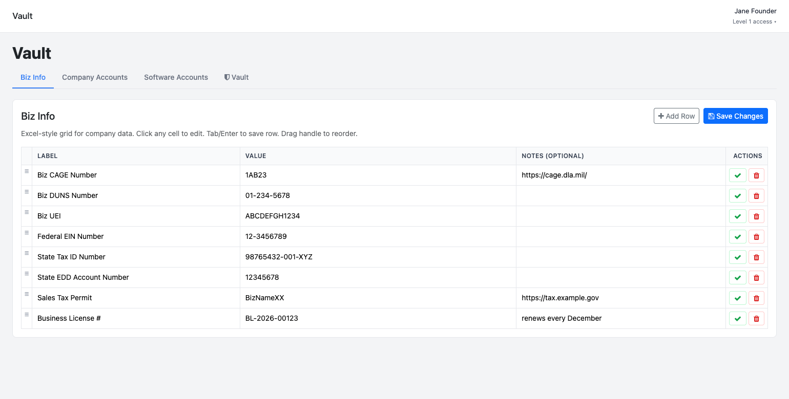
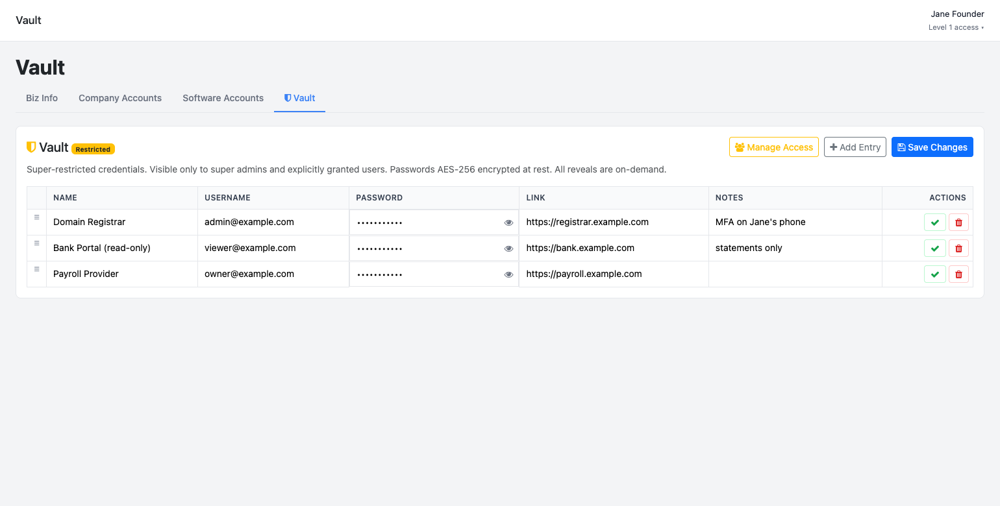

# System: Vault Module

Company-records + credentials manager for an admin portal. Four tabs: **Biz Info** (Excel-style grid of company identifiers — EIN, UEI, CAGE, tax IDs, licenses), **Company Accounts** and **Software Accounts** (login inventories with AES-256-encrypted passwords, on-demand reveal, per-row privacy), and **Vault** (super-restricted credentials visible only to super admins and explicitly granted users). Single PHP page + 4 JSON API endpoints + 5 MySQL tables.

**Type:** self-contained admin subsystem (1 page, 4 APIs, 5 tables, no build step).

**Reference implementation:** PHP 8 + MySQL + vanilla JS (fetch), Bootstrap 5 + AdminKit styling. Extracted from a production portal (Alta Apps "Marketing / Alta Info" module) and renamed: module → **Vault**, first tab → **Biz Info**. The code in [reference/](reference/) already carries the new names — it is paste-ready.

> **Stack-neutral:** the grids are plain tables + fetch calls; port the endpoints to Express/FastAPI and the page to React if the target isn't PHP. Keep the crypto scheme and the access model — they are the substance of this module.

---

## Visual Reference

Screenshots of the built result (demo data — see [reference/demo.html](reference/demo.html) for the static mock they were rendered from):

| View | Preview |
|------|---------|
| Biz Info tab — Excel-style grid, inline edit, drag-reorder |  |
| Vault tab — restricted badge, masked passwords, Manage Access |  |

---

## Integration Prompt

> Paste everything below this line into the target project.

---

You are given a task to integrate a **Vault Module** (company info + credential manager) into an existing admin portal.

The portal must already provide: session auth with a user array (`id`, `name`, `level` where level ≤ 1 = super admin), a per-module permission helper (`can('vault','view'|'add'|'edit'|'delete')` or equivalent), a MySQL connection, and a page chrome (header/menu/footer includes). Map those to the target's equivalents.

### 1. Tabs / features

| Tab | Table | What it does |
|-----|-------|--------------|
| **Biz Info** | `vault_info` | Label / Value / Notes rows for company identifiers (EIN, UEI, CAGE, DUNS, state tax IDs, licenses). Excel-style grid: click any cell to edit, Tab/Enter saves the row, drag handle reorders (`sort_order`). |
| **Company Accounts** | `vault_company_accounts` | Name / Username / Password / Link / Notes. Passwords **AES-256-CBC encrypted at rest**; the list endpoint returns `password: ''` and a reveal endpoint decrypts one row on demand (👁 button). A row can be marked **Private** (`is_private`) — then only its creator and super admins see or edit it. |
| **Software Accounts** | `vault_software_accounts` | Identical behavior to Company Accounts; separate table to keep inventories apart. |
| **Vault** | `vault_secrets` + `vault_secrets_access` | Same credential grid, but the whole tab is hidden unless the user is a super admin **or** has a grant row in `vault_secrets_access`. Super admins manage grants in a modal ("Manage Access"). |

All four grids share the same interaction model: Add Row → inline edit (dirty rows highlighted) → Save Changes (batch) or per-row ✓; delete with confirm; drag to reorder.

### 2. Schema

Full DDL in `reference/schema.sql`. Summary:

```sql
vault_info               (id, label, value, notes, sort_order, created_at, updated_at)
vault_company_accounts   (id, name, username, password_enc, link, notes,
                          is_private, created_by, sort_order, created_at, updated_at)
vault_software_accounts  (same shape as vault_company_accounts)
vault_secrets            (id, name, username, password_enc, link, notes,
                          created_by, sort_order, created_at, updated_at)
vault_secrets_access     (user_id PK, granted_by, granted_at)
```

### 3. Crypto (do not weaken)

- Key: `VAULT_ENC_KEY` env var — **64 hex chars** (32 bytes). Generate: `openssl rand -hex 32`. Endpoints refuse to run (HTTP 500) if the key is missing/short.
- Encrypt: AES-256-CBC, fresh random 16-byte IV per value, stored as `base64(iv + ciphertext)` in `password_enc`.
- List responses never include plaintext (`password: ''`); decryption happens only in the single-row reveal action.
- Leave password blank on edit = keep the stored value.
- The page CSS blocks printing (`@media print` hides everything) — keep it.

### 4. Access model

| Actor | Biz Info | Company/Software Accounts | Vault tab |
|-------|----------|---------------------------|-----------|
| User with `can('vault','view')` | read/write per `add/edit/delete` perms | same, but private rows only if creator | hidden |
| Super admin (level ≤ 1) | everything | everything incl. private rows | full + grant/revoke access |
| Granted user (`vault_secrets_access` row) | per perms | per perms | full CRUD, no access management |

### 5. Files to copy

```
admin/vault.php                      ← page (4 tabs, all JS inline)  [reference/vault.php]
admin/api/vault_info.php             ← Biz Info CRUD                 [reference/api/vault_info.php]
admin/api/vault_company_accounts.php ← Company Accounts CRUD+reveal  [reference/api/vault_company_accounts.php]
admin/api/vault_software.php         ← Software Accounts CRUD+reveal [reference/api/vault_software.php]
admin/api/vault_secrets.php          ← Vault CRUD+reveal+grants      [reference/api/vault_secrets.php]
```

Each file's top `require_once` block points at the reference portal's `connection.php`, `security.php`, `includes/security_helpers.php`, `includes/env_loader.php` — swap for the target portal's equivalents (DB handle `$dbnew`, `require_auth()`, `can()`, CSRF helper, env loader).

### 6. API contract (all endpoints)

All are same-origin, session-authed, JSON. `GET` lists; `POST` mutates with `action` field:

| action | params | behavior |
|--------|--------|----------|
| *(GET)* | — | list rows ordered by `sort_order` (passwords blanked; private rows filtered unless creator/admin) |
| `save` | `id?` + row fields | insert or update; blank password keeps stored value; sets `created_by` on insert |
| `delete` | `id` | delete row |
| `reorder` | `order[]` (ids) | rewrite `sort_order` |
| `reveal` | `id` | return decrypted password for one row (403 if private and not creator/admin) |
| `grant` / `revoke` | `user_id` | *(vault_secrets only, super admin only)* manage `vault_secrets_access` |
| `list_access` | — | *(vault_secrets only)* grants + user names |

Responses: `{ ok: true, ... }` or `{ error: "..." }` with proper HTTP status (401/403/422/500).

### 7. Menu + permission wiring

- Sidebar: one item — label **Vault**, icon `fa-shield`, page `vault.php`, guarded by `can('vault','view')`.
- Register the `vault` module in the portal's permission matrix (view/add/edit/delete).
- Tab switching is `?tab=info|accounts|software|vault`; unknown/unauthorized values fall back to `info`.

### 8. Environment

```
VAULT_ENC_KEY=<64 hex chars>   # openssl rand -hex 32 — back it up; losing it loses all stored passwords
```

### 9. Acceptance checklist

- [ ] All four tabs render; Vault tab hidden for a non-granted level-2 user
- [ ] Add/edit/delete/reorder rows in each grid; dirty-row highlight; batch save
- [ ] Password stored encrypted (inspect DB: `password_enc` is base64, ≠ plaintext)
- [ ] Reveal (👁) returns plaintext for authorized users only; private rows blocked for non-creators
- [ ] Blank password on edit keeps old value
- [ ] Grant a user Vault access → tab appears for them; revoke → disappears
- [ ] Missing `VAULT_ENC_KEY` → APIs return 500, no silent plaintext storage
- [ ] Print attempt shows the confidentiality notice instead of the page
